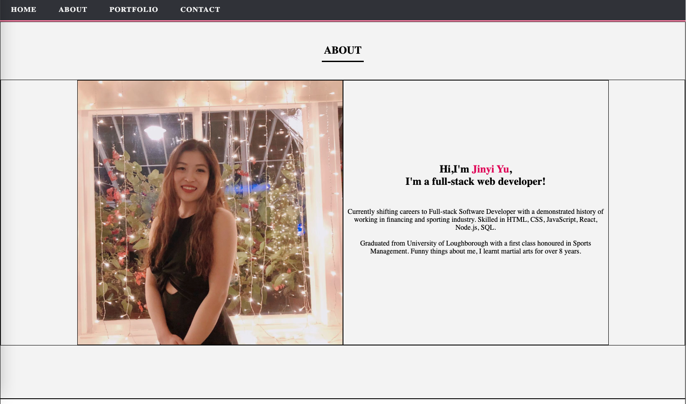
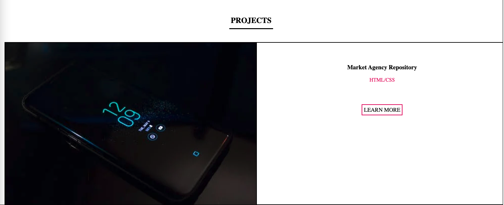
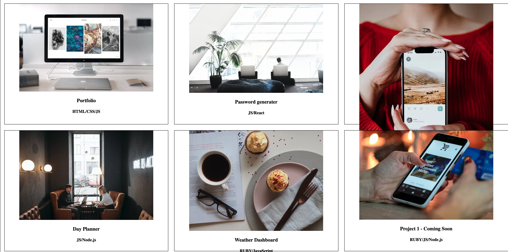

# my-personal-protfolio

## Table of Contents

- [About this Project](#about-this-project)
- [Links to the Project](#Links-to-the-Project)
- [CSS Styling Briefing](#CSS-Styling-Briefing)
- [Mock-Up](#Mock-Up)
- [Technologies](#Technologies)
- [Upcoming features](#Upcoming-features)
- [How To Contact Me](#How-To-Contact-Me)
- [Authored by](#Authored-by)

## About this Project

```
This project is designed using HTML and CSS, focuing on building my personal deployed website shown sets of my pieces of completed projects.
```

## Links to the Project

Check out the Github Repository [Here](https://github.com/jinyiyu/my-personal-protfolio)

Check out the deployed URL [Here](https://jinyiyu.github.io/my-personal-protfolio/)

<br>

## CSS Styling Briefing

In order to implement the responsiveness of my website, I used several CSS elements such as Flexbox and applied media quires to provide better user experience.

- Its fits both mobile and desktop users' need depends on the different layouts I applied
- The positioning of the pages is responsiveness according to the users preference of the page size
- Users can access to different functioning links if interested.

## Mock-Up

The following screenshots in the taggle list show the web application's appearance and functionality:

<details>
<summary> About Me Section</summary>



</details>

<details>
<summary> Projects Section</summary>




</details>

<details>
<summary> Contact Me Section</summary>


</details>

<br />

## Technologies

- HTML
- CSS
- Javascript
- Bootstrap
- Github

## Upcoming features

- The rest of my projects is yet to be added alongside my progressing of the protfolio.
- More amination feature and more responsive activities is awaiting to be added in the future.

## How To Contact Me

Please contact me if you have any inquiries

[](https://github.com/jinyiyu)
[](https://www.linkedin.com/in/jinyiyu/)
[](https://www.instagram.com/jinyiyu517/)
[](mailto:yujinyiicxk@gmail.com)

## Authored by

### **Jinyi Yu**
